# Minimum example of terraform - CodeDeploy + Lambda.
## Deployment process
First, terraform provisions all resources.



When provisioning is completed and Lambda is updated, terraform triggers CodeDeploy to update Lambda version tied to specific alias.


In this step, you can choose deployment method below.

- Blue/Green
- Canary
- All at once

## Code structure
```
terraform
├── envs
│   └── example
│       ├── aws.tf
│       └── main.tf
└── module
    ├── codedeploy
    │   ├── codedeploy.tf
    │   ├── iam.tf
    │   ├── temp.yml
    │   └── variables.tf
    └── lambda
        ├── iam.tf
        ├── lambda.tf
        ├── output.tf
        ├── src
        │   └── main.py
        ├── upload
        │   └── lambda.zip
        └── variables.tf
```
